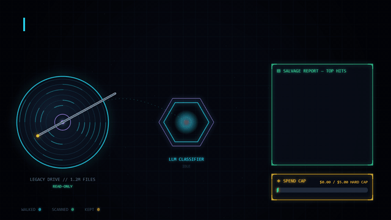

# hdd-analyzer



Use Jev (TypeSafe's System One model) to triage old hard drives for
semantically valuable files. It walks a drive for free, estimates the token
and dollar budget for classifying every file, then runs a capped LLM scan
and produces a ranked report so a human can decide what's worth keeping.

## Pipeline

1. `walk` - deterministic, free directory walk. Writes `runs/NAME/inventory.jsonl`
   (path, size, mtime, extension, category, dedupe key) and a
   `runs/NAME/walk-errors.log` for anything unreadable. No network calls.
2. `estimate` - token and dollar estimate for scanning the inventory. No network.
3. `scan` - local extraction (first bytes of text/code, first pages of PDFs,
   document.xml/sharedStrings.xml for docx/xlsx) followed by one Jev call per
   file, under a hard spend cap. Appends to `runs/NAME/results.jsonl` and is
   resumable: re-running skips files whose dedupe key is already recorded.
4. `report` - ranks the results into `runs/NAME/report.md` (overall top-N plus
   per-category top-20 tables) and `runs/NAME/report.csv` (all rows, flattened).
   Every row carries a `verified` column: `content` when Jev actually read the
   file, `name-only` when it only saw the file name and metadata. Content-verified
   rows are listed first in each table, with name-only matches in their own
   clearly separated subsection, so a high score driven purely by a suggestive
   filename (e.g. `passport.pdf` with no extractable text) cannot be mistaken
   for a verified hit.
5. `annotate` - backfills `metadata_only`/`extraction_status` onto an existing
   run's `results.jsonl` by re-running local extraction only, zero API calls.
   Useful after an extraction bug fix, to correct old results without
   re-spending on the LLM call. Defaults to only the rows currently surfaced
   by the report tables; `--all` covers every row.
6. `ocr` - local, free, zero-API-call OCR pass over an existing run. Selects
   name-only image rows and name-only PDF rows whose extraction found no
   text (`extraction_status: "no_text"`), runs Tesseract on each, and writes
   `runs/NAME/ocr.jsonl`. By default OCRs the top 200 eligible rows by
   `value_score` with `value_score >= 2.0` (the high-ranked filename guesses
   worth verifying); `--all` OCRs every eligible row, `--limit` caps the
   total either way. `runs/NAME/ocr.jsonl` holds real file content excerpts
   (potentially credentials or other PII) and is gitignored along with the
   rest of `runs/`; never print it verbatim. `scan --from-ocr` re-classifies
   the rows OCR recovered content for, using the OCR excerpt in place of
   extraction (`extraction_status: "ocr"` in the results and report).
7. `manifest` - the final deliverable: a salvage list of what to copy off the
   drive before it is wiped. Read-only over `results.jsonl`/`inventory.jsonl`,
   never writes them. Writes into `runs/NAME/manifest/`:
   `copy-list.txt` (one absolute source path per line, sorted by directory,
   UNC paths like `\\wsl.localhost\...` left unchanged since robocopy accepts
   them directly), `copy-list-verified.txt` and `copy-list-name-only.txt`
   (the same list split by whether Jev actually read the content or judged
   it from the filename), `credentials.md` (every row scoring >= 0.6 on
   credentials, paths only, with a warning to rotate anything still valid),
   `by-category.md` (a table per category plus a top-30 directory rollup so
   whole folders, e.g. an Obsidian vault, are obviously worth copying
   wholesale), and `summary.txt` (counts, total bytes, and a documented
   robocopy example for driving the copy list). A file is included if its
   value_score or any category probability clears the thresholds when
   content-verified (or OCR-verified); a name-only row is only included if
   it scores high on credentials, financial_legal, or personal, since a
   suggestive filename is real signal there but not for, say, a name-only
   "irreplaceable" game save.

## Setup

Copy `.env.example` to `.env` and fill in `TYPESAFE_API_KEY`:

```
copy .env.example .env
```

`TYPESAFE_API_KEY` accepts either a native TypeSafe key or an OpenRouter key
(prefix `sk-or-`). OpenRouter keys are routed to OpenRouter's Decisions API
automatically. Set `JEV_PROVIDER=openrouter` or `JEV_PROVIDER=typesafe` in
`.env` to override the auto-detection.

Dependencies are managed with `uv`. Install with:

```
uv sync
```

`ocr` needs the Tesseract binary installed separately (it is not a Python
dependency); see docs/RUNBOOK.md's "OCR setup" section. If it is not on
PATH, set `TESSERACT_CMD` in `.env` to the full path, unquoted or
single-quoted (a double-quoted value is unescaped by python-dotenv, which
turns the `\t` in `\tesseract.exe` into a literal tab).

## Usage

Run everything through `uv run hdd-analyzer <command>`.

### Test drive 1: old Windows system drive

Value lives mostly under `F:\Users`.

```
uv run hdd-analyzer walk F:\ --run winbox --include Users
uv run hdd-analyzer estimate --run winbox
uv run hdd-analyzer scan --run winbox --cap 5
uv run hdd-analyzer report --run winbox
```

### Test drive 2: old Linux root filesystem (WSL-mounted)

Value lives mostly under `home/`.

```
uv run hdd-analyzer walk \\wsl.localhost\Ubuntu\mnt\wsl\PHYSICALDRIVE4p2 --run linuxbox --include home
uv run hdd-analyzer estimate --run linuxbox
uv run hdd-analyzer scan --run linuxbox --cap 5
uv run hdd-analyzer report --run linuxbox
```

### OCR a run's name-only images and no-text PDFs

No API spend; only needs Tesseract installed (see Setup above).

```
uv run hdd-analyzer ocr --run winbox
uv run hdd-analyzer scan --run winbox --from-ocr --cap 0.25
uv run hdd-analyzer report --run winbox
```

### Build the salvage manifest before wiping a drive

```
uv run hdd-analyzer manifest --run winbox
```

## Safety

- Drives are opened read-only by convention. The tool never writes outside
  the repo's `runs/` directory.
- `scan` prints the candidate file count, estimated tokens, estimated cost,
  and the hard cap, then asks for interactive `y` confirmation before
  spending anything (skip with `--yes`).
- `scan --dry-run` runs extraction only, with zero API calls.
- The default hard cap is $5 and is enforced before dispatching each batch,
  using actual spend so far plus a worst-case estimate of the in-flight
  batch. Results already written to `results.jsonl` are never truncated or
  discarded when the cap is hit.
